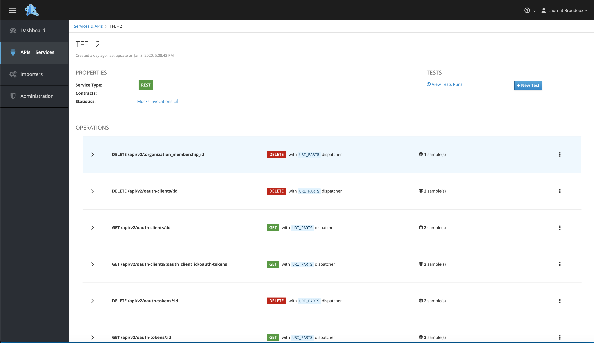
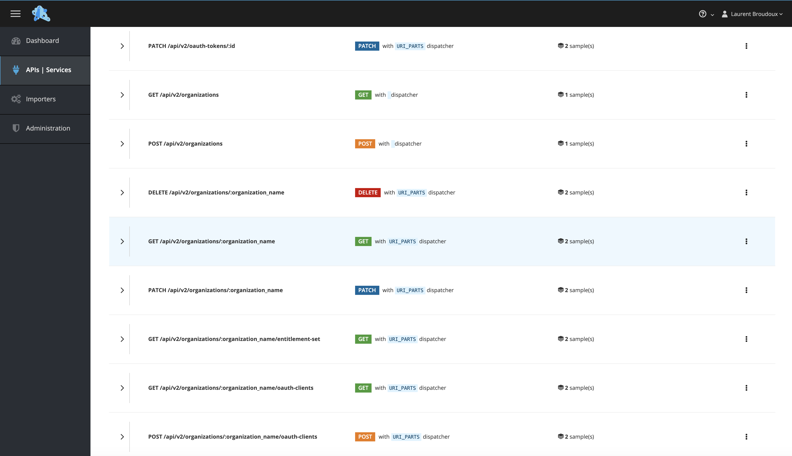
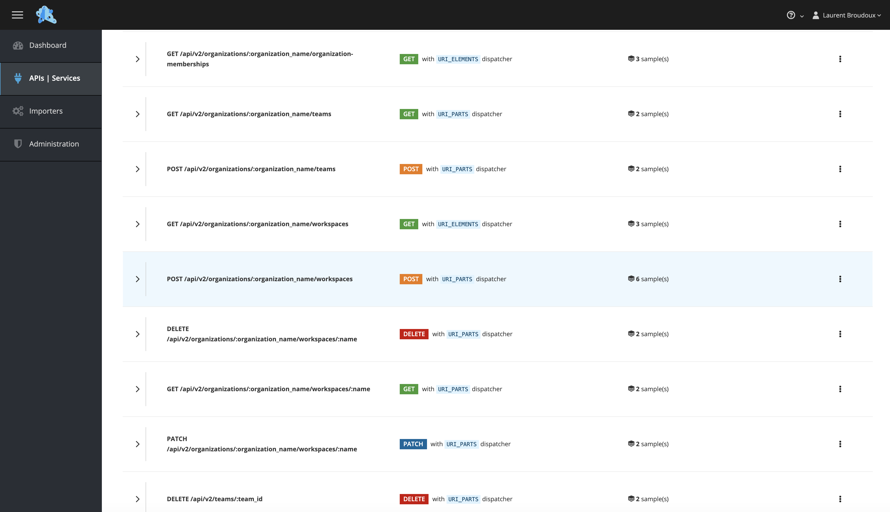
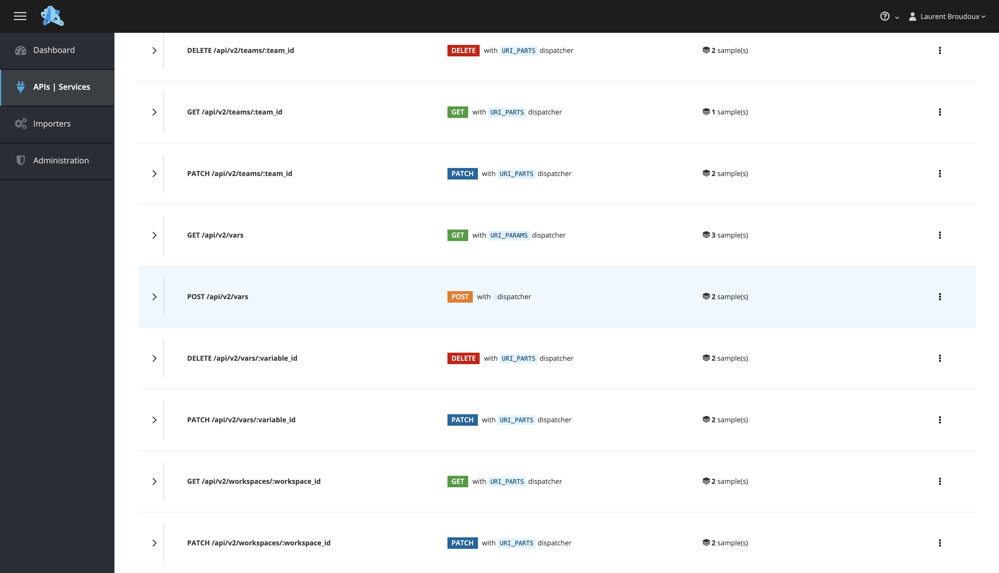

## terraform-enterprise

This repository contains different artifacts related to Terraform Enterprise APIs.

Terraform is a tool for building, changing, and versioning infrastructure safely and efficiently. Terraform can manage existing and popular service providers as well as custom  in-house solutions.

Please visit [HashiCorp Terraform's](https://www.hashicorp.com/products/terraform/) for a sneak peak at it.

### API Mocks

First artifact is a collection of API mocks for using with [Microcks](https://microcks.io). Microcks is an open source tool for turning your API contract, Postman Collection or SoapUI project into live mocks in seconds.

Our artifact imported into Microcks allows you to access comprehensive, real-world samples on how Terraform Enterprise API is expected to work. Then it allows you to easily mock-up a Terraform instance for your integration tests without "polluting" a real instance.

#### Setup

Once you've got your Microcks instance up-and-running, just create a new `Importer` pointing on the following URL:

```
https://github.com/nehrman/terraform-enterprise/raw/master/mocks/terraform-enterprise.api.v2-RC1.postman_collection.json
```

or directly donwload and re-upload this file into Microcks! ;-) 

#### Overview

Our Postman collection for Terraform Enterprise, imported into Microcks embeds 30+ operations of the API and more than 70 samples. Once imported into Microcks, you should have the following results with `Mocks URLs` ready to use! 🚀 








